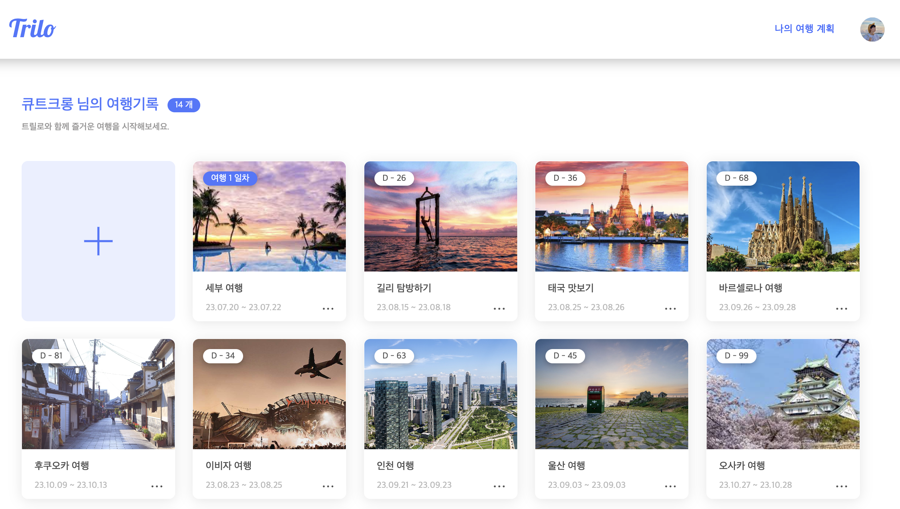
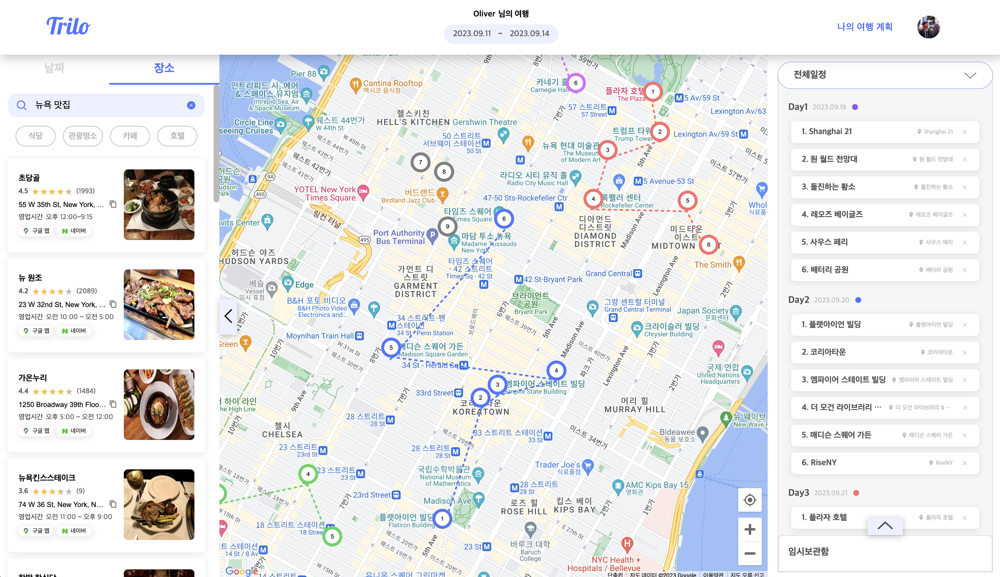
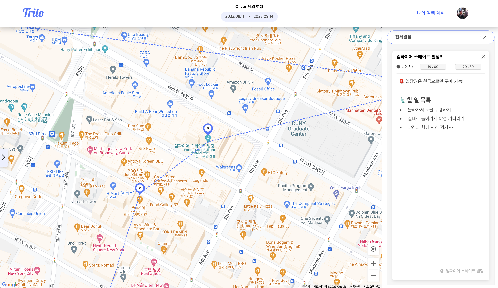
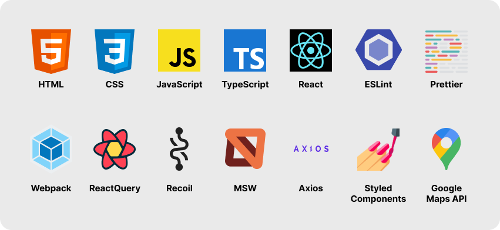

 

 

# [Trilo](http://cosain-trilo.com/)와 함께 여행 계획을 세워보아요!

여행 계획 어디서 짜시나요?

&emsp; Trilo에서는 **손 쉽게 여행 계획**을 짜고, 여행하며 모바일로 **여행 계획을 바로바로 확인**할 수 있습니다!

### 🇫🇷 여행 별 모아보기

### 🏴󠁧󠁢󠁥󠁮󠁧󠁿 여행 계획 작성하기

### 🇩🇪 상세 일정 작성하기

 

# 프로젝트 개요

### Period

&emsp; **23.02.15 ~ 23.07.14**

### Link

&emsp; - [Trilo 배포 사이트](http://cosain-trilo.com/)

&emsp; - [Trilo 소개 페이지](https://www.notion.so/Trilo-7c990cfbcefb40909c0e6eec34fd6218?pvs=21)

&emsp; - [개발용 Notion](https://www.notion.so/Trilo-ddb60446d04448b185faaf1a6a9c1842?pvs=21)

&emsp; - [팀 GitHub](https://github.com/teamCoSaIn)

&emsp; - [API Docs](http://api.cosain-trilo.com/docs/)

### Member

#### &emsp; FrontEnd: 🧑🏻‍💻 **[Bangtae](https://github.com/bangdler)**, 🧑🏻‍💻 **[Oliver](https://github.com/jthw1005)**

#### &emsp; BackEnd: 🧑🏻‍💻 **[ttasjwi](https://github.com/ttasjwi)**, 🧑🏻‍💻 **[Lukas](https://github.com/pia2011)**

#### &emsp; Design: 👩🏻‍🎨 Joy

 

# 기술 스택

### FrontEnd

### Infra

### Common

